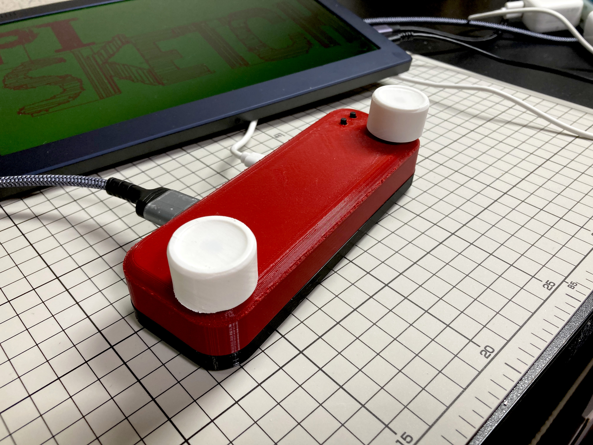
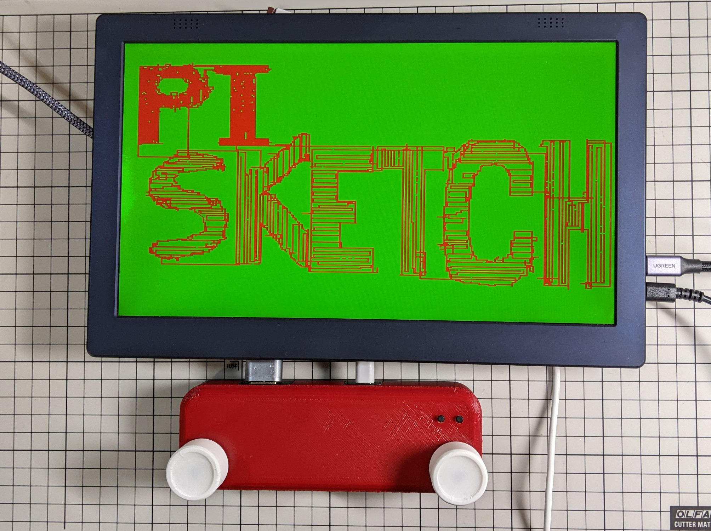
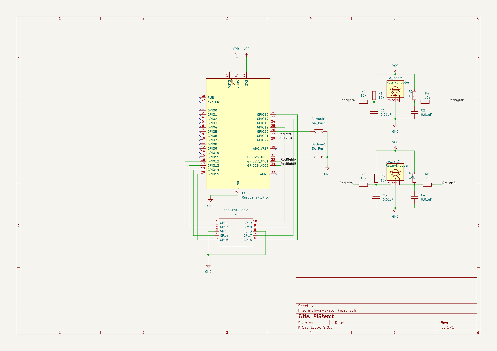

# PiSketch

 


## Overview

PiSketch is the digital version of a drawing toy.

PiSketch allows you to draw lines using two knobs on a standard display connected via an HDMI compatible cable.

PiSketch is built on top of the excellent [PicoDVI](https://github.com/Wren6991/PicoDVI) project.

## Features
- Draw lines using two rotary knobs.
- Built with Raspberry Pi Pico
- HDMI-compatible video output via PicoDVI
- Fully 3D-printable enclosure.
- Fun!


## How to build
The overall build process is as follows:
1. Print 3D models for the enclosure
1. Build the circuit board.
1. Assemble all parts
1. Make [software](https://github.com/gangi-man/pi-sketch) for PiSketch and install uf2 file to Raspberry Pi Pico on the board.

### Print 3D models
Print all [STL files](https://www.thingiverse.com/thing:7367036).

No special priint settings are not required, but printing without supports produce a clearner rounded edge on the enclosure.

### Build the circuit board.
Cut a prototyping PCB to 95mm x 45mm and solder the components according to the schematic.

  

### Assemble parts
Insert the rotary encoders into the enclosers and secure them with the nuts.

Insert tactile swtiches into the enclosure.

Close the enclosure.

### Build the PiSketch Firmware
1. Clone this repository
1. Initialize submodules
   ```
   >git clone https://github.com/gangi-man/pi-sketch
   >cd pi-sketch
   >git submodule update --init --recursive
   ```
1. Invoke cmake and build the project
   ```
   >cmake -DPICO_SDK_PATH=../pico-sdk -S . _B build
   >cd build
   >make
   ```
1. Install the built uf2 file (build/pi_sketch.uf2) to the Raspberry Pi Pico.

Note: This build process has only been tested only on Linux.
Other platforms may work, but have not been verified.

## Usage
Turning the left knob extends the line horizontally, while turning the right knob extends it vertically.

### Bill of Materials
* Raspberry Pi Pico x 1
* [Pico-DVI-Sock](https://github.com/Wren6991/Pico-DVI-Sock) x 1 I bought one at [Switch Science](https://www.switch-science.com/products/7431)
* [STL files files](https://www.thingiverse.com/thing:7367036).
* PCB board x 1 (larger than 95mm x 45mm)
* Rotary encoder [EC12E2420801](https://tech.alpsalpine.com/j/products/detail/EC12E2420801/) x2
* Capacitor 0.01uF x 4
* Resistor 10k x 8
* Micro USB Typ-B connector x1 (a USB Type-C may be a better choice)
